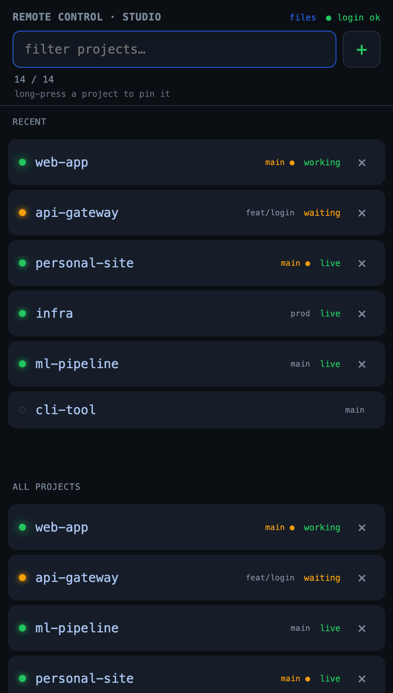

# remoteclaude

[](https://github.com/uofm-matt/remoteclaude/actions/workflows/ci.yml)
[](LICENSE)

Start a Claude Code Remote Control session on your computer from your phone, in
any of your project directories, with that project's full context. No SSH, no VS
Code left running, no Tailscale on the host. Runs on macOS or Linux.

Anthropic's Remote Control lets you *drive* a Claude Code session from the Claude
mobile app — but the session has to already be running, started at your computer in
one project's directory. So you can pick up what you left running; you can't start a
fresh session, switch to another project, or spin up a new one without going back to
your desk. remoteclaude closes that gap: it starts, switches, and creates sessions
from your phone.

You'll need Claude Code on the host (macOS or Linux), a Claude plan with Remote
Control, the Claude mobile app to drive sessions, and a claude.ai login (OAuth — API
keys won't open Remote Control).

<p align="center">
  
</p>

## What it does

A small always-on web server on the host shows a searchable list of every
directory under `~/projects`. Tap one and it launches claude with Remote Control
in that project's root (resuming the project's last thread when one exists),
held in a detached `tmux` session so it survives the HTTP request returning. The session shows up in the Claude app under Code with a green
dot, and you drive it from there. Because it launched in the project root, it
loads that project's `CLAUDE.md`, `.claude/` settings, and project MCP exactly
like the VS Code extension (and re-reads `CLAUDE.md` — global and project — on
every launch, so edits are live on the next tap).

By default each tap **resumes the project's most recent thread** (`claude
--continue`), so the phone opens where you left off, and it **closes any desktop
session** for that same project first so they don't fight over one thread. See
[RUNBOOK.md](RUNBOOK.md#resume--takeover); toggle with `RC_RESUME`/`RC_TAKEOVER`.

You can also create a new project from the interface: tap the **+** button (or
type a name that matches nothing and pick the "create & start" row). It makes the
folder under `~/projects`, runs `git init`, writes a starter `CLAUDE.md`, marks
the directory trusted, and launches the session.

When a phone-driven turn is running on a repo you also have open locally, a desk
indicator (a zsh prompt tag, and working/waiting dots in the launcher) tells you,
so you don't edit the same files out from under it. And launching claude at the
desk while a phone session owns that project is guarded too: source
[`rc_guard.sh`](rc_guard.sh) (bash or zsh) in your claude wrapper and it stops first, offering
to attach to the running session, take it over at the desk, or start a separate
fresh one — instead of dying on the thread the phone session is holding.

## File share

Tell a session to drop a file in `~/rc-share` and grab it from your phone: the launcher
serves that one directory at `/files` — browse, download, and upload, each with a live
status line and a confirmation when it lands (same token gate,
`realpath`-confined, never your other projects). Copy files in rather than symlinking them — a symlink into a
project resolves outside the share and is refused over HTTP by design. For a real drive
letter on a Windows machine, share `~/rc-share` over macOS SMB and `net use` it (by IP)
over the same subnet route. See [RUNBOOK.md](RUNBOOK.md).

## Android app

Optional. The [`android/`](android/) subproject is a thin native WebView wrapper: a
home-screen app that loads the launcher's own page chrome-free (no browser URL bar),
reusing the entire web UI with zero server changes. It's a sideloaded APK, no Play
Store. A real installable PWA isn't possible here because the launcher is plain HTTP
(service workers need a secure context), so the wrapper is the clean way to an app
frame. Build and install steps in [android/README.md](android/README.md).

## Why per-project launch

`claude remote-control` is rooted at its launch directory, so switching projects
genuinely requires a per-directory launch. With dozens of projects, a daemon per
project doesn't scale, and a single server over the parent folder would read
files but wouldn't anchor any one project's `CLAUDE.md`/`.claude/`. On-demand
launch in the project root is the only model that preserves full per-project
context. One server already accepts many concurrent sessions within a directory,
so the launcher only handles switching between projects.

## Components

| File | Role |
|---|---|
| `rc_launcher.py` | Token-guarded web server: launch, stop, live status, create-new-project, and `/files` browse/download/upload of `~/rc-share`. Runs under launchd (macOS) or systemd --user (Linux). The HTTP tier only — the work behind each route lives in the modules below. |
| `rc_sessions.py` / `rc_share.py` | The launcher's two clusters: starting, describing and closing phone-driven sessions; and the `~/rc-share` file share (what a path may reach, how a directory is listed, the abandoned-upload sweep). |
| `rc_config.py` / `rc_tmux.py` / `rc_git.py` / `rc_desk.py` | Leaves both clusters share: every env-derived setting plus the audit log and TTL cache; the tmux verbs (also used by `rc_guard.py`); per-project branch/dirty and the opt-in snapshot; the desk-claude scan and takeover. |
| `rc_templates.py` / `rc_page.py` / `rc_files_page.py` | The embedded frontend: the chunks both pages share and the per-request fill, then one file per page. |
| `rc_state_hook.py` | Claude hook recording a remote session's turn state (working/waiting/idle) for desk-side awareness. |
| `rc_status.py` / `rc_prompt.zsh` | Reader + opt-in zsh prompt tag showing when a remote turn is live in your current repo. |
| `rc_guard.py` / `rc_guard.sh` | Opt-in desk-side launch guard (logic in Python, one shim for bash and zsh): wraps your `claude` so it offers attach / takeover / fresh instead of launching blind into a live phone session's thread. |
| `rc_healthcheck.py` | Watchdog that runs `claude auth status` every 30 min; notifies (desktop + optional ntfy) if the login lapses. |
| `install.sh` / `uninstall.sh` | Service setup and teardown; generates the token outside the repo, registers the state hook. |
| `RUNBOOK.md` | Full setup, daily use, login recovery, and design notes. |

## Install

```sh
git clone https://github.com/uofm-matt/remoteclaude.git
cd remoteclaude
./install.sh
```

It installs `tmux` if missing, generates a token (stored at
`~/.config/rc-launcher/token`, never in the repo), registers the state hook,
loads the service (launchd on macOS, systemd --user on Linux), and prints your
phone URL plus the remaining host-specific steps. See [RUNBOOK.md](RUNBOOK.md)
for the complete walkthrough, including the network setup and how to recover if
the login lapses while you're away.

## Security

The launcher binds `0.0.0.0` and is guarded by a random token kept in a `0600`
file outside the repo (`~/.config/rc-launcher/token`) — never in version control,
the service files, or CI. The token is sent once (URL or bookmark),
stored as an HttpOnly cookie, then dropped from the URL so it stays out of logs
and history. Reach it over your LAN or a VPN/subnet route; don't expose the port
directly to the internet. Remote Control sessions need the claude.ai OAuth login
(API keys won't open them).

## License

MIT — see [LICENSE](LICENSE).
